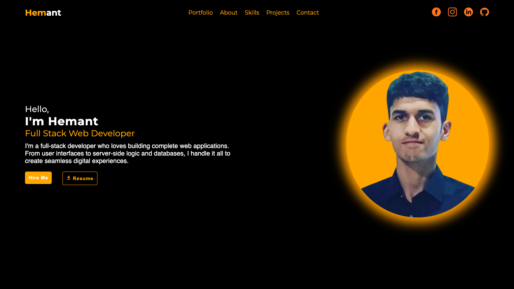

# 🌐 Personal Portfolio Website

This is my **personal portfolio website** built using **HTML, CSS, and JavaScript**, featuring an **interactive UI**, **smooth animations**, and **hover effects**.  
It highlights my **skills, projects, and contact information** in a **responsive and modern layout**.

---

## ✨ Features

- 🎨 Interactive and clean user interface  
- 🖱️ Smooth animations and hover effects  
- 📱 Fully responsive design  
- 📂 Sections included:
  - Portfolio  
  - About  
  - Skills  
  - Projects  
  - Contact  

---

## 🛠️ Technologies Used

- **HTML5**  
- **CSS3**  
- **JavaScript (ES6)**  

---

## 🚀 Live Demo

🔗 [Live Demo](https://issarhemant.github.io/Portfolio-Site/)

---

## 💻 GitHub Repository

💾 [GitHub Repo](https://github.com/IssarHemant/Portfolio-Site.git)

---

## 📬 Contact

If you'd like to connect or collaborate, feel free to reach out!  
📧 Email: hemantissar2001@email.com  
🌐 Portfolio: [[your-live-demo-link.com](https://issarhemant.github.io/Portfolio-Site/)]

---

⭐ *If you like this project, don't forget to star the repo!* ⭐
